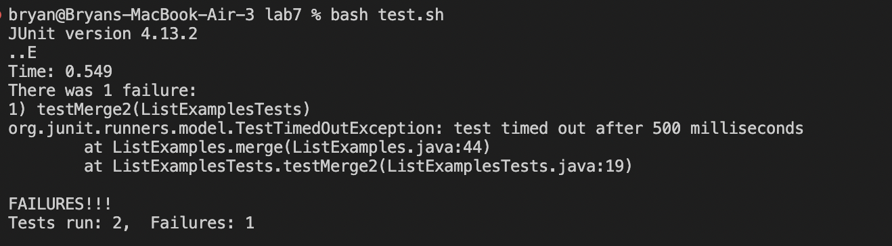
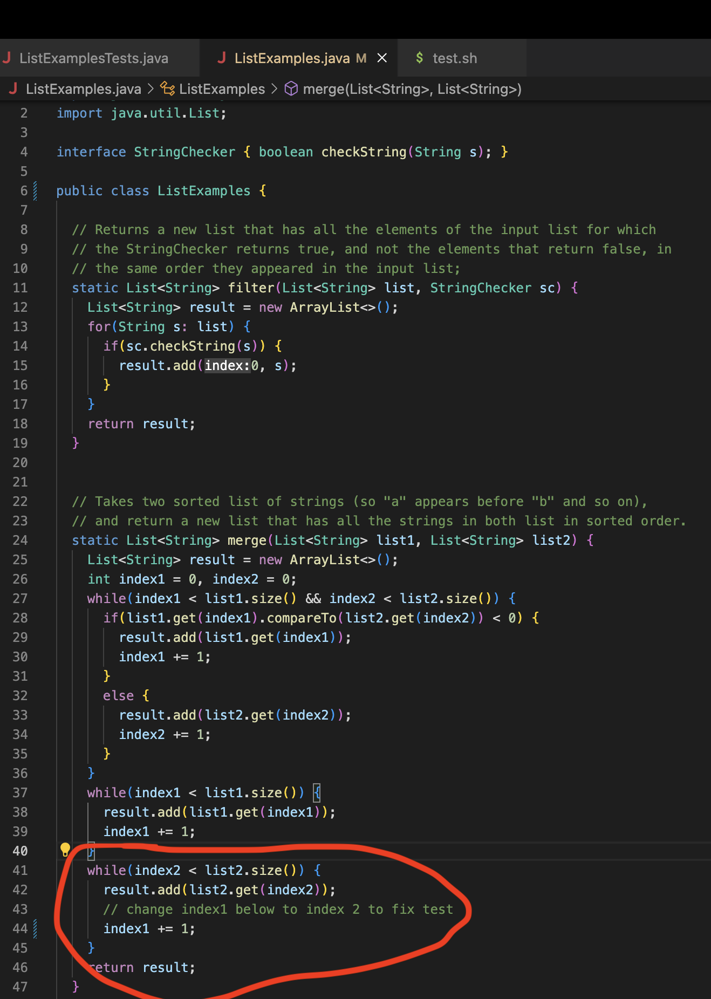
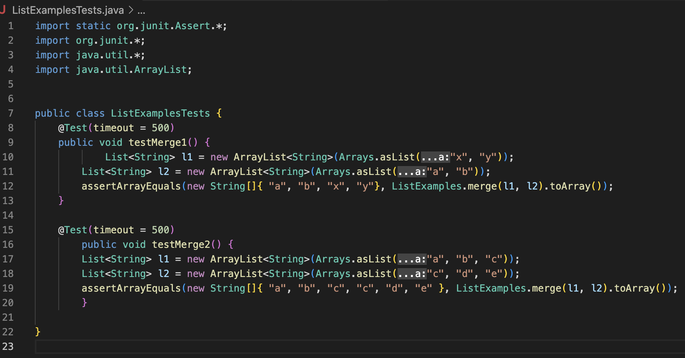
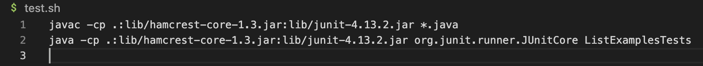
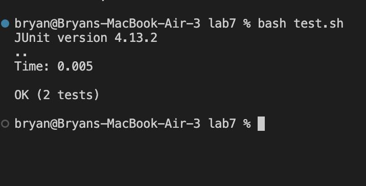
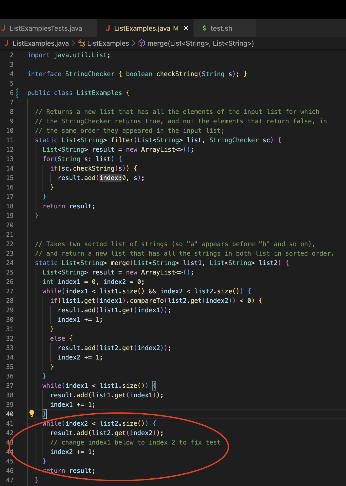

# Lab Report 5: Debugging
In this lab report I will focus on debugging. It will include the interactions between a student and a TA trying to work out bugs within a program.

## Part 1: Student Question in Edstem and TA Responses

### Student Initial EdStem Post
***What environment are you using (computer, operating system, web browser, terminal/editor, and so on)?***
I am using a Macbook on MacOS in Visual Studio Code.

***Detail the symptom you're seeing. Be specific; include both what you're seeing and what you expected to see instead. Screenshots are great, copy-pasted terminal output is also great. Avoid saying “it doesn't work”.***

I am trying to run tests from the lab7, however whenever I try running the test on within "ListExamplesTests.java" I seem to be getting a time out error on the test ```testMerge2```. The test is testing the merge method that is contained within the file "ListExamples.java". It is meant to merge two lists together. Below You can see the error, as well as what the code is supposed to do, which is merging the two list together.







***Detail the failure-inducing input and context. That might mean any or all of the command you're running, a test case, command-line arguments, working directory, even the last few commands you ran. Do your best to provide as much context as you can.***

The test has two lists that it is supposed to merge. The two lists look like this: ```l1 = {"a", "b", "c"}``` and ```l2 = {"c", "d", "e"}```. After calling the merge method on these two lists in the form of ```ListExamples.merge(l1, l2).toArray();``` it is supposed to return a new list with the contents containing the the contents from both lists of ```l1 & l2``` in order. The output list should look like this: ```{"a", "b", "c", "c", "d", "e"}```. However, when I run the command ```bash test.sh```, which runs the tests within ```ListExamplesTests.java"``` in the terminal it gives me an error that is above. I have made sure that I am in the correct directory to run all of these commands by doing the ```pwd``` command which gives me an output of ```/Users/bryan/Documents/GitHub/lab7``` which is indeed the correct directory. Down below I have provided the code for the ```test.sh``` script to make sure that my commands within it are also correct.




### TA First Response
***Suggestion from TA***
I noticed that you mentioned that you had a timeout error when you ran the tests. This usually means that you have an infinite loop running within your code. This is most likely to be within one of the while loops within ```ListExamples.java```. Make sure to check your code and try and spot any possibilites of infinite loop(s).

### Student Followup on TA Suggestion
I was able to figure out the bug thanks to your recommendation! After looking through my code within ```ListExamples.java```, like you mentioned, I was able to find an infinite loop in the final while loop of the code. More specifically it looked like this:
```
    while(index2 < list2.size()) {
      result.add(list2.get(index2));
      // change index1 below to index 2 to fix test
      index1 += 1;
    }
```
The issue was that at this point within the test that was failing ```index2``` was less than ```list2.size()``` so therefore the while loop ran. More specifically, under the failing test ```index2``` was 0 and ```list2.size()``` was 3. The bug is this: ```index1 += 1;```. This is the bug because this while loop is supposed to increment ```index2``` in this case, but it is incrementing ```index1``` instead. The issue with this is that ```index2``` will never be incremented and therefore, the condition ```while(index2 < list2.size())``` will always be true which results in the while loop running infinitely. Here is my terminal output after fixing this infinte while loop:



### Section 3 in Part 1:
In order to fix the bug within the code we need to have all of the proper files which are ```ListExamples.java```, ```ListExamplesTests.java```, and ```test.sh```. Here are the contents of these files before we fix the bug:


We also need to make sure that we are in the correct directory in order to be able to run these files. In order to do this we can do the ```pwd``` command which should show us that we are in the ```/Users/bryan/Documents/GitHub/lab7``` directory where our files are stored. If it doesn't pop up with the correct directory, you want to command ```cd``` into the correct directory to be able to run our files.

In order to trigger the bug we simply ran the test.sh file by doing ```$ bash test.sh```. This gave us the following failure without updating the code to fix the bug:


In order to fix the bug we have to fix the following while loop in ```ListExamples.java```:
```
    while(index2 < list2.size()) {
      result.add(list2.get(index2));
      // change index1 below to index 2 to fix test
      index1 += 1;
    }
```
To fix it we have to change the ```index1``` to ```index2``` so that it increments the correct variable. This will fix the bug because now the while loop will increment ```index2``` properly and the ```while(index2 < list2.size())``` will eventually not be satisfied and therefore the while loop will end which fixes our issue of timing out. We can see the change made within the files below and the tests that succeeded after changing the file:





